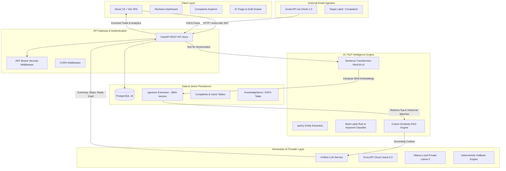
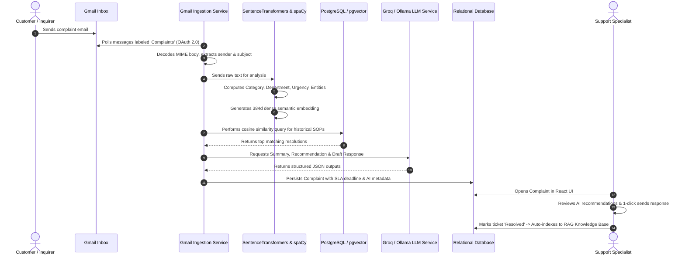
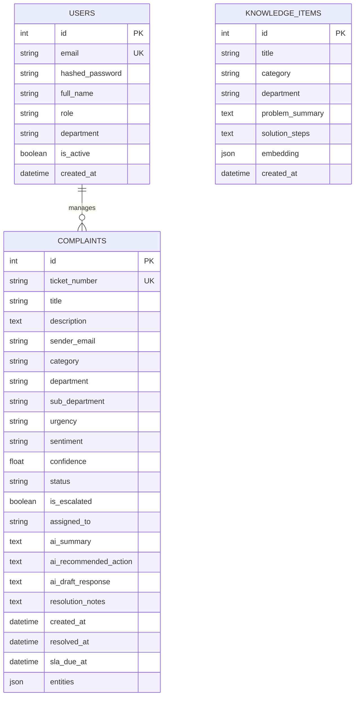

# AutoTriage AI - System Architecture & Technical Specification

## 1. Executive Summary
**AutoTriage AI** is a production-grade, enterprise-ready Complaint Classification, Department Routing, and Retrieval-Augmented Generation (RAG) Platform. The system automatically ingests incoming customer complaints from Gmail, extracts semantic embeddings, performs multi-label categorization and urgency scoring, retrieves relevant historical resolutions via vector search (`pgvector`), and drafts empathetic customer replies with actionable resolution advice using Generative AI (Groq API & local Ollama).

---

## 2. Technology Stack Overview

| Domain | Technology | Purpose & Capability |
| :--- | :--- | :--- |
| **Frontend** | React 18, Vite | High-performance Single Page Application (SPA) |
| **Routing** | React Router v6 | Client-side routing with guarded authentication |
| **Styling** | Tailwind CSS, CSS Glassmorphism | Bespoke dark-mode UI with fluid responsive layouts |
| **Data Viz** | Recharts | Interactive real-time metrics, SLA health & trend charts |
| **API Client** | Axios | Intercepted HTTP client managing JWT Bearer tokens |
| **Backend API** | FastAPI, Python 3.12 | Asynchronous high-throughput REST API with OpenAPI/Swagger |
| **Validation** | Pydantic v2 | Strict schema validation and serialization |
| **ORM & DB** | SQLAlchemy 2.0, Alembic | Declarative persistence with multi-engine support |
| **Primary Database**| PostgreSQL 16 | ACID-compliant relational data store |
| **Vector Search** | `pgvector` | 384-dimensional dense vector indexing & cosine similarity |
| **NLP & ML** | Sentence Transformers (`all-MiniLM-L6-v2`) | High-accuracy semantic embedding generation |
| **Linguistics** | spaCy & Scikit-learn | Named entity extraction, tokenization, classification |
| **Cloud GenAI** | Groq API (`llama-3.3-70b-versatile`) | Ultra-low latency cloud LLM inference |
| **Local GenAI** | Ollama (`llama3`, `mistral`) | 100% private offline LLM execution |
| **Ingestion** | Gmail API, OAuth 2.0 | Automated polling and MIME email message decoding |
| **Testing** | Pytest, FastAPI TestClient | Comprehensive automated unit and integration suite |

---

## 3. High-Level System Architecture

---

## 4. End-to-End Ingestion & Triage Data Flow

---

## 5. Database Schema & Entity Relationships

---

## 6. Service Layer Specifications

### 6.1 NLP Classification Engine (`nlp_engine.py`)
- **Semantic Vector Generation**: `sentence-transformers/all-MiniLM-L6-v2` produces a 384-dimensional dense vector normalized with L2 Euclidean distance.
- **Entity Extraction**: Uses `spaCy` linguistic analysis (`en_core_web_sm`) and enterprise regexes to isolate transaction codes (`TXN-...`), order IDs (`#ORD-...`), currency figures (`$`, `USD`, `INR`), dates, and emails.
- **Urgency Matrix**:
  - `Critical` (4-hour SLA): Financial loss, service outages, security compromises.
  - `High` (8-hour SLA): Billing discrepancies, inaccessible portals, urgent deadlines.
  - `Medium` (24-hour SLA): Inconveniences, functional glitches.
  - `Low` (48-hour SLA): General queries and feedback.

### 6.2 Unified LLM Provider Interface (`llm_service.py`)
Provides automated resilience through a 3-tier cascade:
1. **Tier 1 (Groq API)**: Sub-second cloud inference with `llama-3.3-70b-versatile`.
2. **Tier 2 (Ollama Local)**: Air-gapped on-premise execution via `http://localhost:11434`.
3. **Tier 3 (Deterministic Heuristic Engine)**: Rule-based template generator that guarantees the application **never fails or hangs** if network or LLMs are unavailable.

### 6.3 Retrieval-Augmented Generation (`rag_service.py`)
When a complaint is triaged:
1. The complaint's semantic vector is queried against `KnowledgeItem` records.
2. Top-K similar cases with cosine similarity $\ge 0.70$ are supplied as authoritative operational context to the LLM.
3. Upon ticket resolution, support agents can toggle "Index solution into RAG Knowledge Base", facilitating continuous organizational learning.

---

## 7. Security & API Authentication
- **Authentication**: Stateless JSON Web Tokens (JWT) signed with HMAC-SHA256 (`HS256`).
- **Password Security**: Passwords hashed using `bcrypt` via PassLib.
- **CORS**: Configurable cross-origin resource sharing headers.
- **Gmail OAuth 2.0**: Read-only least-privilege scope (`https://www.googleapis.com/auth/gmail.readonly`).
